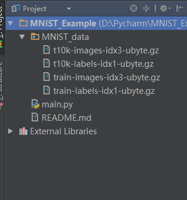

# MNIST机器学习入门

根据TensorFlow官方文档学习加整理MNIST实例

官方英文文档：<http://www.tensorflow.org/> 

中文TensorFlow社区：www.tensorfly.cn

项目中只是对代码进行了简明的注释，以便之后复习的时候能更快的回忆起来。

详细信息请查看官方文档。

本项目在中文社区中的地址：[MNIST入门](http://www.tensorfly.cn/tfdoc/tutorials/mnist_beginners.html)

项目架构：

在学习次项目的过程中我好奇input_data.read_data_sets()这个函数是如何获取到数据的，于是上网搜到两篇不错的技术文档，共有需要的人学习。

[使用Tensorflow操作MNIST数据](http://www.cnblogs.com/eczhou/p/7860508.html)

[MNIST进阶之read_data_sets()](https://blog.csdn.net/qq_33254870/article/details/81388620)