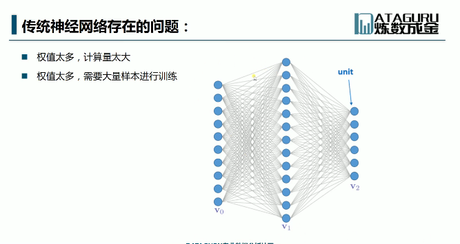
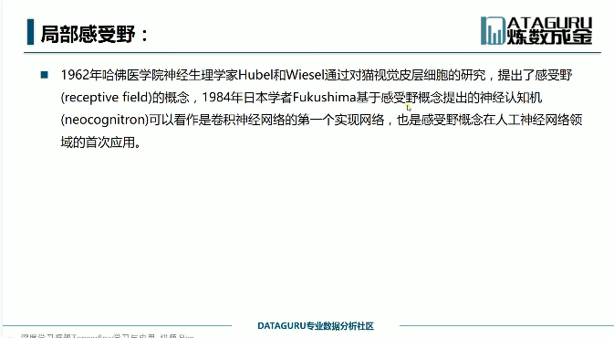
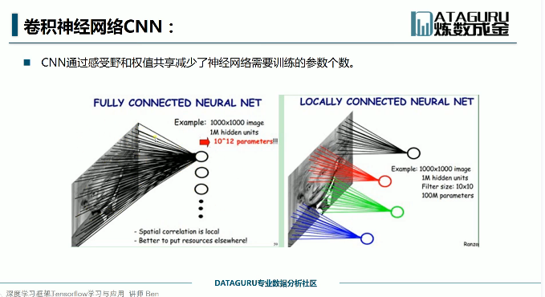
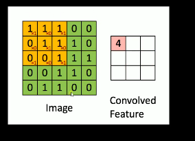
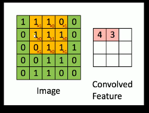
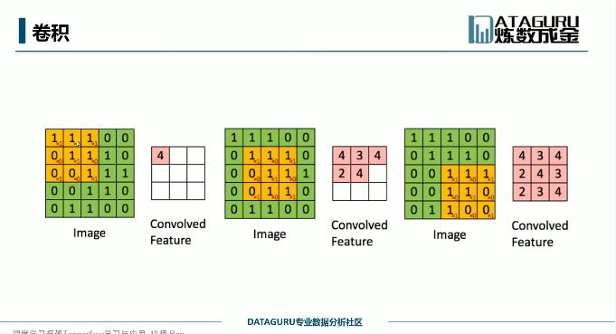
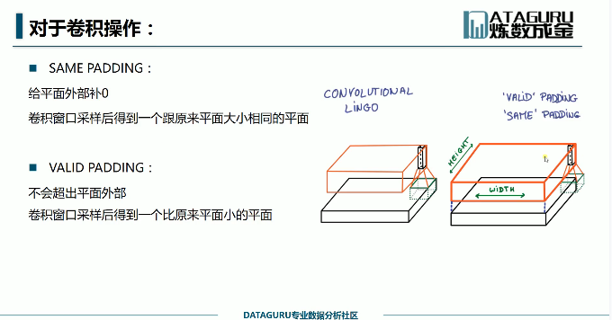
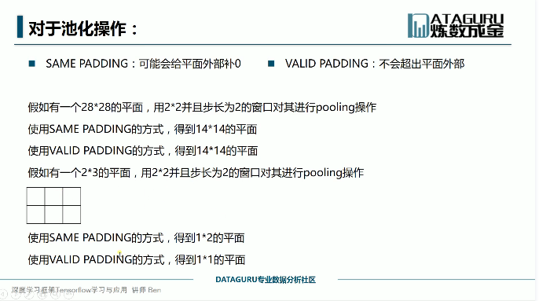

先放一放，可以理解基础的卷积神经网络，但是放到代码中各种的维度和参数，我搞不清楚为什么要这样设置，得去再充充电。

---

---

---

卷积神经网络的理解可以参考下面的博客，写的都非常的通俗易懂。

**卷积核是如何进行工作的：**

在这里列出来两个代码中的函数，其它的解释都在代码中做了注释：

**1.tf.nn.conv2d(x,w,strides=[1,1,1,1],padding='SAME')**

- **x**：input tensor of shape [batch,in_heights,in_width,in_channels] (批次大小，图片长和宽，通道数：黑白图片		为1，彩色图片为3)
- **w**：filter/kernel tensor of shape [filter_height,filter_width,in_channels,out_channels]
  ​	滤波器/卷积核
- **strides**:   strides[0]=strides[1]=1
  ​		strides[1]:代表x方向的步长
  ​	 	strides[2]:代表y方向的步长
- **padding:** 只有两种模式 SAME or VALID

**2.tf.nn.max_pool(x,ksize=[1,2,2,1],strides=[1,2,2,1],padding='SAME')**

- 基本参数和上面的一样
- **ksize[1,x,y,1]** : x,y代表窗口的长和宽，其它默认为1

参考博客：

[卷积神经网络CNN总结](https://www.cnblogs.com/skyfsm/p/6790245.html)

[通俗理解卷积神经网络](https://blog.csdn.net/v_july_v/article/details/51812459)

[ReLU激活函数：简单之美](https://blog.csdn.net/cherrylvlei/article/details/53149381)

[多层卷积网络的基本理论](https://www.cnblogs.com/flyu6/p/7691162.html)

