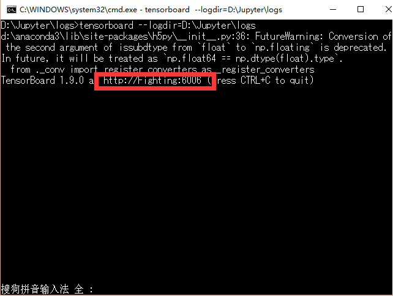

初步操作TensorBoard。

在这个程序里只是用到了如下的两个方法：

    #命名空间
    with tf.name_scope('input'):
    
    # 存的是图的结构
    writer = tf.summary.FileWriter('logs/',sess.graph)
在CMD中输入：tensorboard  --logdir=path

path 为你自定义的图的存储的路径

你会看到TensorBoard给你返回来一个网址，如上图红框中，然后在Google or FireFox 浏览器中输入该网址，这时你就会看到你定义的程序结构。

