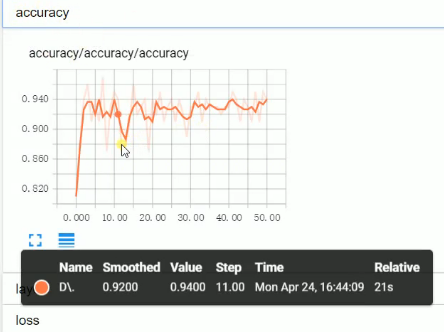
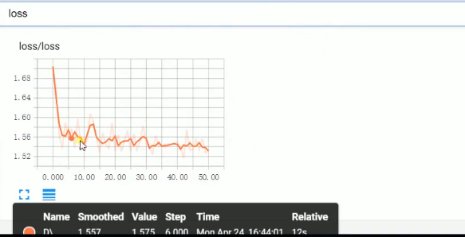
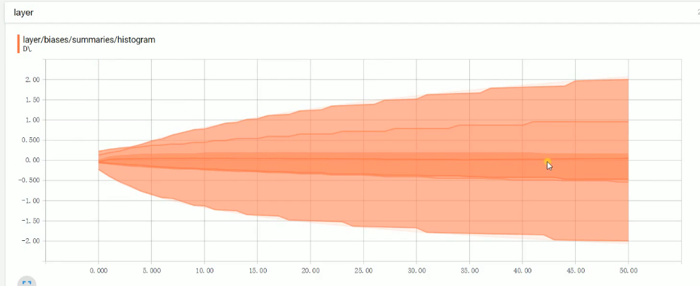
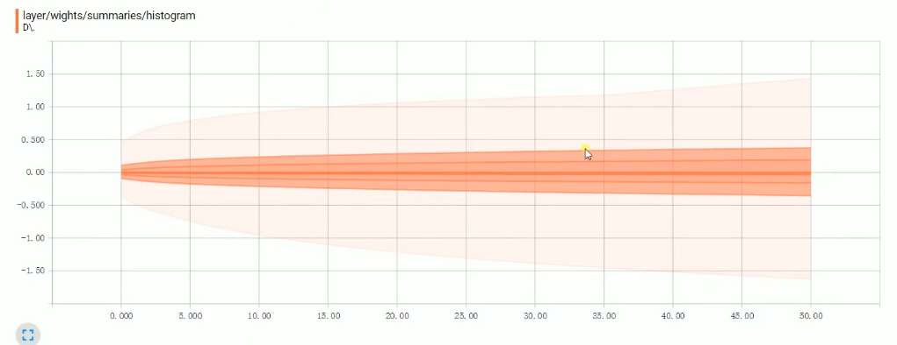

tf.summary常用方法如下：

1、tf.summary.scalar

用来显示标量信息，其格式为：

```
tf.summary.scalar(tags, values, collections=None, name=None)
```

例如：tf.summary.scalar('mean', mean)

一般在画loss,accuary时会用到这个函数。

2、tf.summary.histogram

用来显示直方图信息，其格式为：

```
tf.summary.histogram(tags, values, collections=None, name=None) 
```

例如： tf.summary.histogram('histogram', var)

一般用来显示训练过程中变量的分布情况

还有一些其他的用法，学习一下：

3、tf.summary.distribution

分布图，一般用于显示weights分布

4、tf.summary.text

可以将文本类型的数据转换为tensor写入summary中：

例如：

```python
text = """/a/b/c\\_d/f\\_g\\_h\\_2017"""
summary_op0 = tf.summary.text('text', tf.convert_to_tensor(text))
```

5、tf.summary.image

输出带图像的probuf，汇总数据的图像的的形式如下： ' tag /image/0', ' tag /image/1'...，如：input/image/0等。

**格式：tf.summary.image(tag, tensor, max_images=3, collections=None, name=Non)**

6、tf.summary.audio

展示训练过程中记录的音频 

7、tf.summary.merge_all

merge_all 可以将所有summary全部保存到磁盘，以便tensorboard显示。如果没有特殊要求，一般用这一句就可一显示训练时的各种信息了。

**格式：tf.summaries.merge_all(key='summaries')**

8、tf.summary.FileWriter

指定一个文件用来保存图。

**格式：tf.summary.FileWritter(path,sess.graph)**

可以调用其add_summary（）方法将训练过程数据保存在filewriter指定的文件中

9.tf.reset_default_graph

清空图重新计算


运行方式为：在命令行中输入**: tensorboard –logdir=’path to log-dicrectory’**,然后复制地址去浏览器打开。在浏览器中你会看到你所定义的图的结构。

由于我的电脑运行的比较慢，所以我只是在视频上截了部分图供参考。

准确率的变化：



代价的变化图：



偏置值的直方图：



权重值的直方图：



参考：

[Tensorflow学习笔记——Summary用法](https://www.cnblogs.com/lyc-seu/p/8647792.html)

[视频地址](https://www.bilibili.com/video/av20542427/?p=17)

